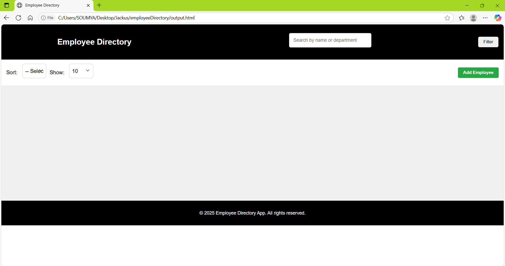
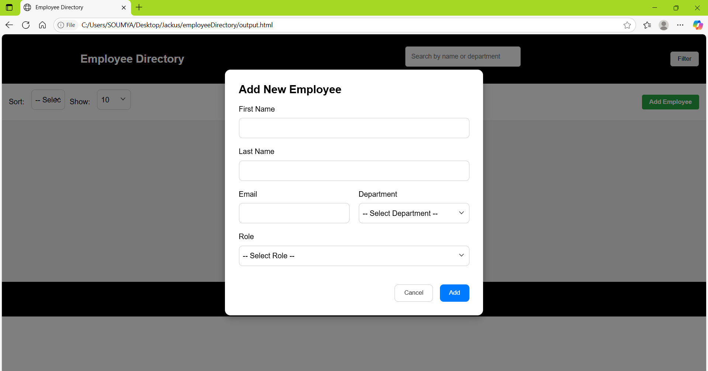
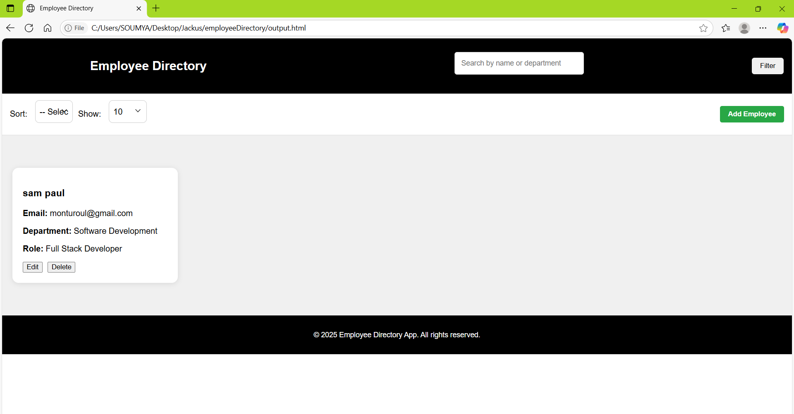
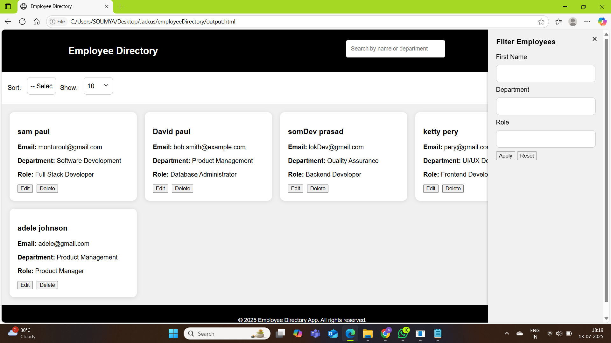
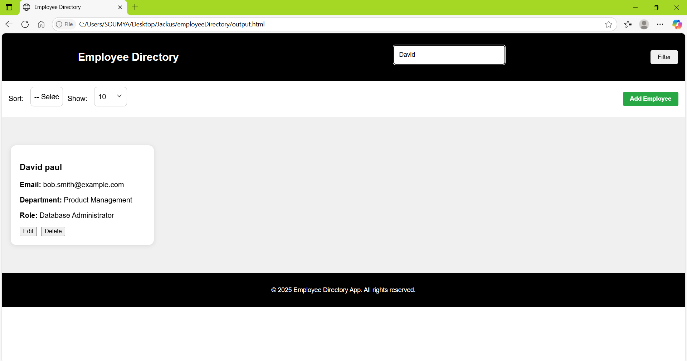
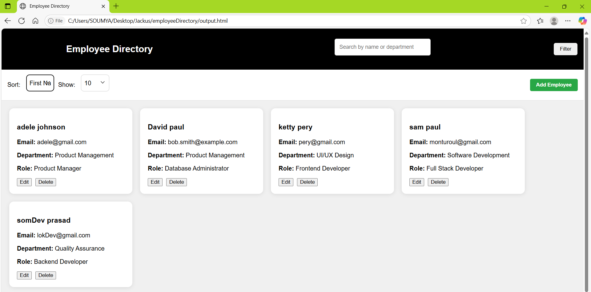

# 👩‍💼 Employee Directory Web App

A modern, interactive employee directory web application built using **HTML**, **CSS**, and **JavaScript**. This app allows you to **add**, **edit**, **delete**, **search**, **filter**, **sort**, and **paginate** employee records dynamically — all on the client side.

## 📌 Features

### ✅ Add / Edit / Delete Employees
- Open a modal form to **add** new employees with key details like name, email, department, and role.
- **Edit** existing entries directly through the card view.
- **Delete** employees with confirmation prompts to avoid accidental removal.

### 🔍 Real-Time Search
- Instantly **search** employees by **first name** or **department** using a responsive input field.
- Case-insensitive and dynamically updates results as you type.

### 🧮 Sorting
- Sort employees by:
  - `First Name` (A-Z)
  - `Department` (A-Z)
- Updates the UI in real-time as the user changes the sort criteria.

### 📄 Pagination
- Choose to display:
  - 10 / 25 / 50 / 100 employees per page
- Dynamically renders only the selected number of employee cards.

### 🧰 Filtering Sidebar (Optional)
- Toggleable filter pane (can be extended further with checkboxes or dropdowns for departments/roles).
- Fully responsive with close (`X`) button for better UX on mobile.

## 💡 Technologies Used

| Technology       | Description                      |
|------------------|----------------------------------|
| HTML5            | Structure of the app             |
| CSS3             | Styling and responsive layout    |
| JavaScript (ES6) | Core logic for all interactivity |
| Freemarker (FTL) | Modular templates for integration|

## 🚀 Getting Started

### 1. Clone the Repo

```bash
git clone https://github.com/soumya1925/employyeDirectory.git
cd employyeDirectory
```
##🛠️ Build the Project
mvn clean install
▶️ Run the App
mvn exec:java
mvn compile exec:java

## 📸 Screenshots

### 🏠 Home Page


### ➕ Add a New Employee
Click on the Add Employee button to open a form modal where you can input:

🧍 First Name & Last Name

📧 Email

🏢 Department

💼 Role


### 🧾 Employee Card Rendering
Once the form is submitted via the Add button, a new employee card is dynamically rendered in the card container below.


###  🗂️ Filter Employees
Click the filter button to acess the  filter parameters
The Filter Employees feature allows you to dynamically narrow down the employee list based on:

👤 Role

🏢 Department


### 🧪 example of filtered data based on first name


### 🔍 Search Employees
Search for employees by **First Name** or **Department** using the  search bar.


### ### ↕️ Sort Employees
Sort the employee cards alphabetically by **First Name** or **Department** from the dropdown.


### 📋 Show Employee Cards

Control how many employee cards you want to display at once using the **"Show"** dropdown.

- Options available: `10`, `25`, `50`, `100`
- Automatically updates the visible cards based on your selection.
